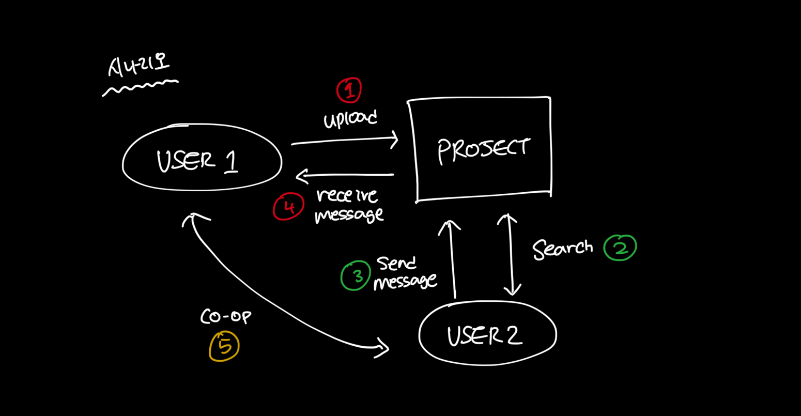
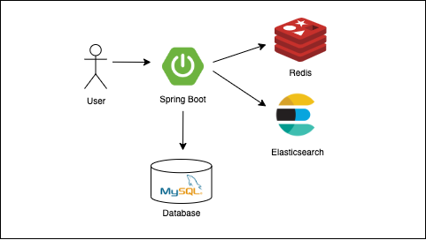
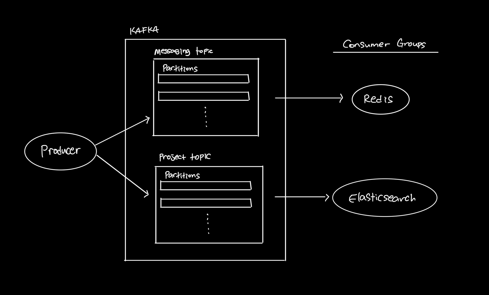

# ProjectShare

사용자들이 자유롭게 프로젝트를 공유하고 팀원들을 찾아 협업하는 플랫폼을 개발하는 프로젝트이다.


## 시나리오 



1. 먼저 사용자는 프로젝트 정보를 담아 올린다.
    ```
    프로젝트 내용
    - 이름
    - 상세 내용
    - 진행 기간
    - 협업자 조건
    - 협업자 인원수
    - 관련 분야 (개발, 마케팅, ...)
    ```

2. 업로드된 프로젝트를 검색해 찾아 볼 수 있으며 프로젝트 취지와 조건이 맞으면 프로젝트 관리자에게 메시지를 보낼 수 있다.

3. 프로젝트 관리자가 수락하면 협업자와 대화를 나누며 프로젝트를 진행한다.


## 아키텍쳐 



프로젝트의 전반적인 흐름은 위 그림과 같다.

```
Spring Boot
- 신속하게 개발하기 위해 Spring Boot를 사용함

Kafka
- 메세지 브로커 역할
- 모든 내용은 Kafka를 통해 토픽에 저장되고 서비스에 활용되는 프로그램들은 정보를 받아와 처리하는 흐름으로 구성함

MySQL
- 메인 데이터베이스로 활용해 유저 정보와 프로젝트 정보를 담는 역할
- Redis에 저장되는 메시지 내용을 백업하는 용도로 사용함

Redis
-  메시지 정보를 빠른 속도로 저장하고 읽기 위해 in-memory 데이터베이스로 사용

Elasticsearch
- 프로젝트를 찾는 용도로 사용함
```


### 카프카 아키텍쳐


