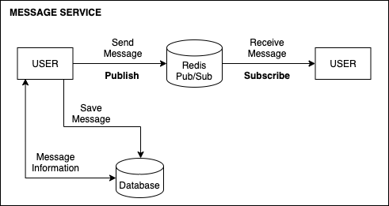

# ProjectShare

사용자들이 자유롭게 프로젝트를 공유하고 팀원들을 찾아 협업하는 플랫폼을 개발하는 프로젝트이다.

## 시나리오 


1. 먼저 사용자는 프로젝트 정보를 담아 올린다.
    ```
    프로젝트 내용
    - 제목
    - 상세 내용
    - 진행 기간
    - 협업자 인원수
    ```

2. 업로드된 프로젝트를 검색해 찾아 볼 수 있으며 프로젝트 취지와 조건이 맞으면 프로젝트 관리자에게 메시지를 보낼 수 있다.

3. 프로젝트 관리자가 수락하면 협업자와 대화를 나누며 프로젝트를 진행한다.


## 아키텍쳐 


프로젝트의 전반적인 흐름은 위 그림과 같다.

```
Spring Boot
- 신속하게 개발하기 위해 Spring Boot를 사용함

MySQL
- 메인 데이터베이스로 활용해 유저, 프로젝트, 메세지 정보를 담는 용도로 사용함
- Redis에 저장되는 메시지 내용을 백업해서 사용함

Redis
- 메시지 정보를 빠른 속도로 저장하고 읽기 위해 in-memory 데이터베이스로 사용
- Redis pub/sub 을 사용해서 서로 다른 서버끼리의 데이터 전달을 도와주는 용도로 사용
- Redis cluster 를 사용해서 신속하게 메시지를 저장하고 읽는 목적으로 사용

Elasticsearch
- Lucene 기반 검색 엔진
- 프로젝트 찾는 용도로 사용
```

### 서비스 아키텍쳐


유저는 처음 사이트에 접속하면 가입을 해야된다. 계정이 있으면 로그인을 통해 메인 화면으로 이동할 수 있다.


프로젝트를 처음 생성하면 먼저 데이터베이스에 저장된다. 그리고 받은 결과를 사용해서 프로젝트용 그룹 메세지가 생성되고 Elasticsearch 에 저장하도록 설계했다.
유저들은 프로젝트를 검색해 프로젝트 관리자에게 메세지를 보낼 수 있고 관리자는 원하는 유저들을 프로젝트용 그룹 메세지에 초대해서 작업을 진행할 수 있다.



만약 서버가 2개 이상이라고 가정하면 1번 서버에 있는 유저가 2번 서버에 있는 유저에게 메세지를 보내려고 하면 중간에 연결해주는 매개체가 필요하다. 
그래서 이 부분을 Redis Pub/Sub 시스템을 사용해서 연결해 주었다. 유저 1이 메세지를 보내면 레디스 서버 채널에 publish 한다.
반대로 다른 서버에 있는 수신자는 레디스 서버 채널에 subscribe 해서 메세지를 받아온다.
그러나 Redis Pub/Sub 에서는 메세지들이 저장되지 않으므로 이를 캐싱 개념으로 최근에 온 문자들은 레디스 서버에 저장했다. 
그리고 저장된 데이터들은 관계형 데이터베이스에 마이그레이션 하는 구조로 메세지 서비스를 만들었다. 